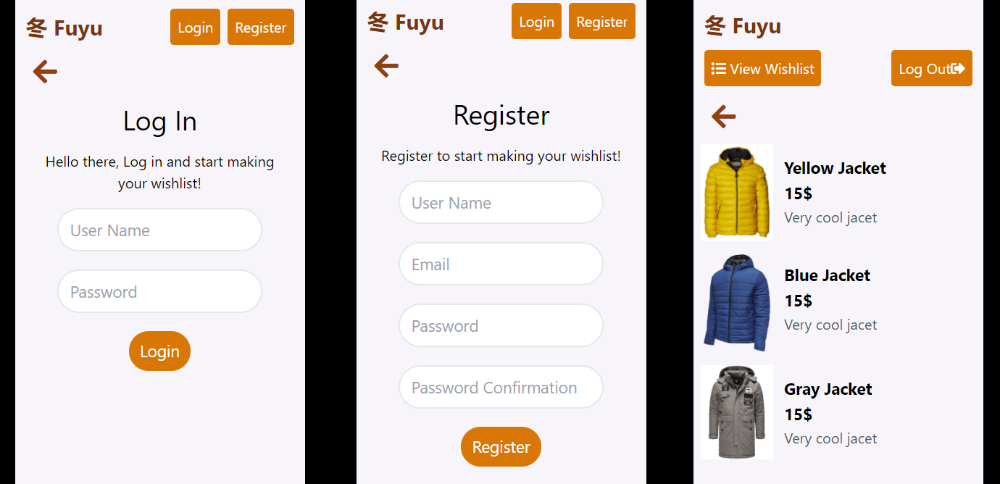

# Fuyu Whishlists 

> 

## UI

## Built With

- React
- Redux
- Tailwind CSS

# Live demo

[Live demo]()

# Getting Started

**To get the local copy of the project up and running you will need to run the following commands on your terminal:**

`git clone https://github.com/omar-labana/fuyu.git`

This project was created with [Create React App](https://github.com/facebook/create-react-app).

## Available Scripts

In the project directory, you can run:

### `npm start`

Runs the app in the development mode.
Open [http://localhost:3000](http://localhost:3000) to view it in the browser.

👤 **Omar Labana**

- Github: [omar-labana](https://github.com/omar-labana)
- Twitter: [@panda4cs](https://twitter.com/panda4cs)
- Linkedin: [Omar Labana](https://www.linkedin.com/in/omar-labana)

## 🤝 Contributing

Contributions, issues and feature requests are welcome!

Feel free to check the [issues page](https://github.com/omar-labana/fuyu-apu/issues).

## 👍 Show your support

Give a ⭐️ if you like this project!

## Acknowledgements

- Design by: [Alexey Savitskiy](https://www.behance.net/gallery/37706679/Circle-(Landing-page-Dashboard-Mobile-App))

- Microverse: [@microverse](https://www.microverse.org/)
